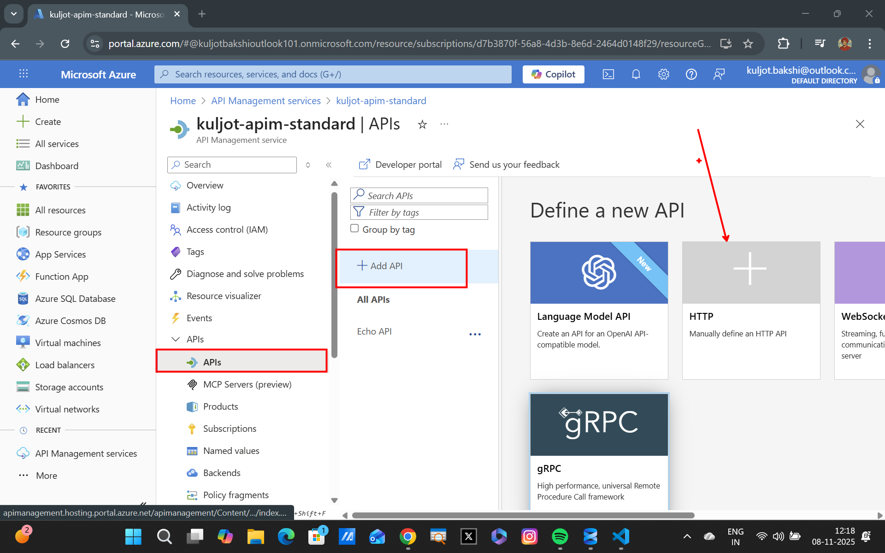
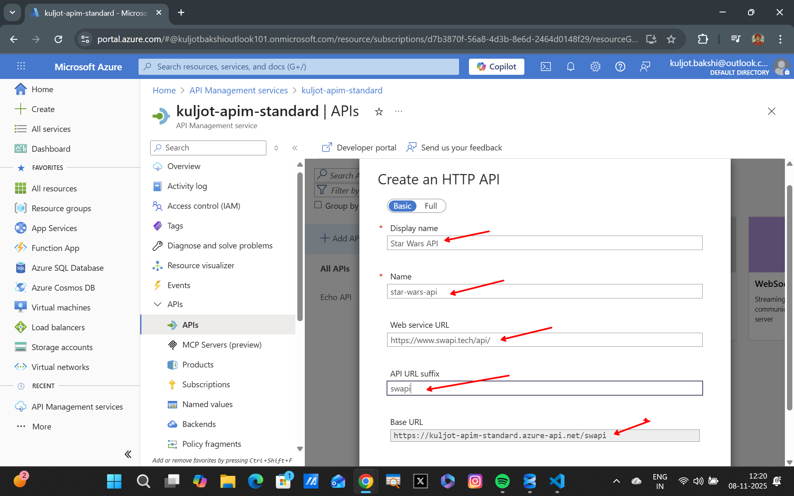
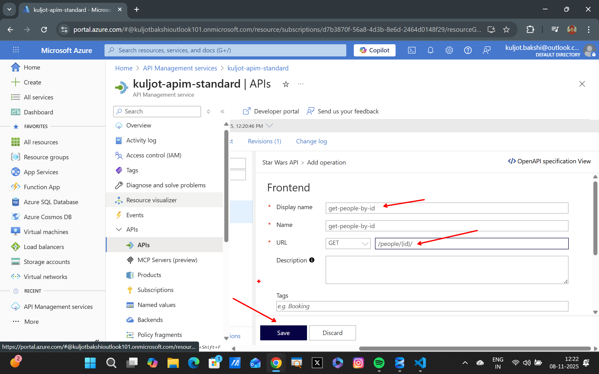
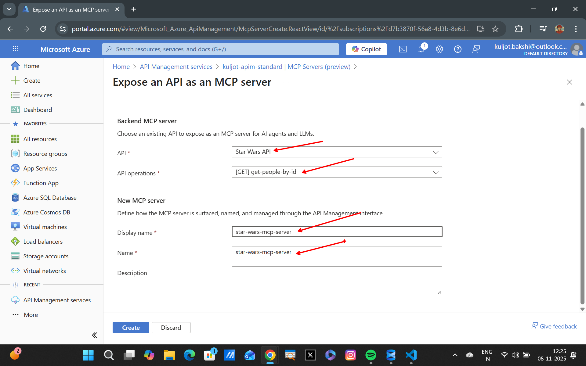
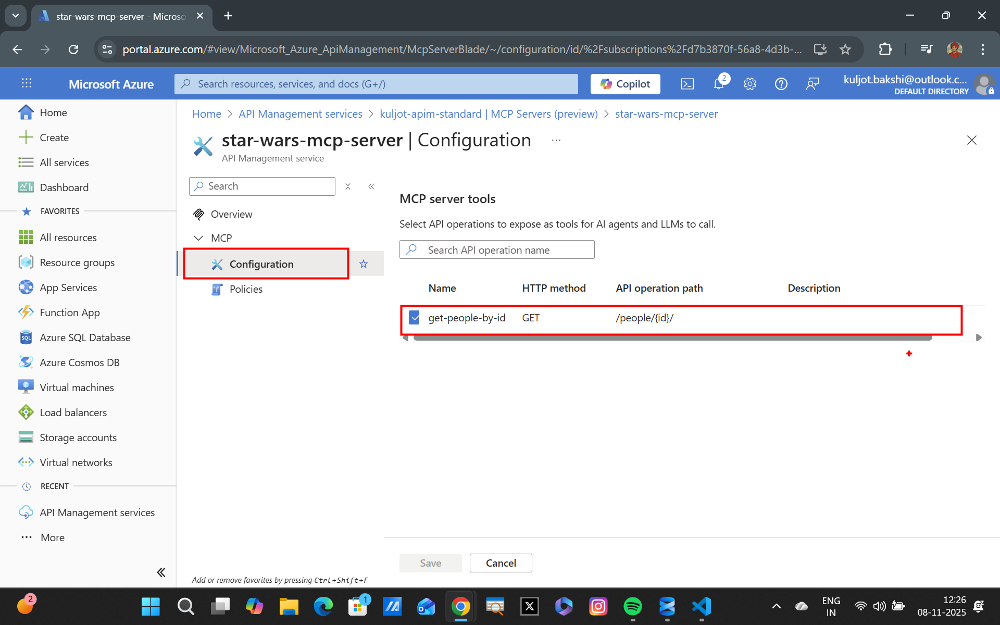

## Importing Existing REST API as MCP Server in APIM

### Lab Overview
In this lab, you will import an existing REST API into Azure API Management (APIM) as a Model Context Protocol (MCP) Server. This allows you to integrate existing REST APIs with AI Agents and leverage the capabilities of MCP.

### Step 1 : Importing the REST API as a Managed API within APIM
We will be using the Star Wars API (https://www.swapi.tech/api/) for this lab. This is a public API that provides data about the Star Wars universe.

Navigate to your APIM instance in the Azure Portal. In the left-hand menu, select `APIs` under the `APIs` section. Then add the Star Wars REST API as a managed API:

--

### Step 2 : Adding GET PEOPLE BY ID Operation
Once the API is imported, we will add an operation to get a person by ID. Click on the newly created API and then select `Add Operation`. Fill in the details as shown below:

--

### Step 3: Adding the Managed REST API as MCP Server
Now that we have added the operation, we will add this API as an MCP server. Navigate to the `MCP Servers` section in the left-hand menu of your APIM instance and click on `Create MCP Server` and select `Expose an API as an MCP Server`.

--

Once the MCP Server is created, you can view the details of the created MCP server, including the endpoint URL and the exposed operations. 

From the `Configuration` tab of the MCP server, you can see the details of the operations that are exposed. You should see the `GET /people/{id}` operation that we added earlier. From this you can also control the REST API operations that you want to expose as MCP operations.

### Next Steps: 
In the next steps, you will learn how to create an AI Agent that can interact with the MCP server and utilize the exposed operations.

### Summary 
In this lab, you successfully imported an existing REST API into Azure API Management (APIM) as a Model Context Protocol (MCP) Server. You also added an operation to get a person by ID and exposed this operation through the MCP server. This setup allows you to integrate existing REST APIs with AI Agents and leverage the capabilities of MCP.
