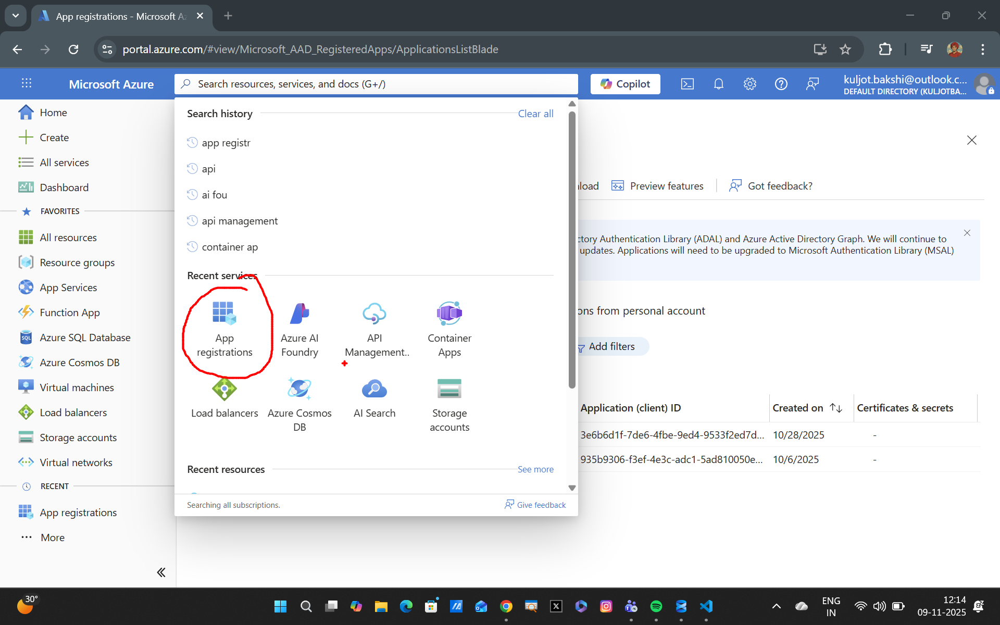
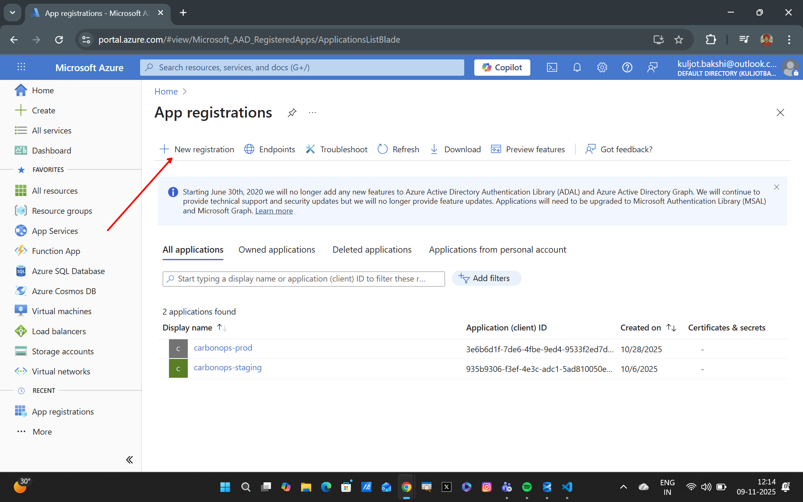
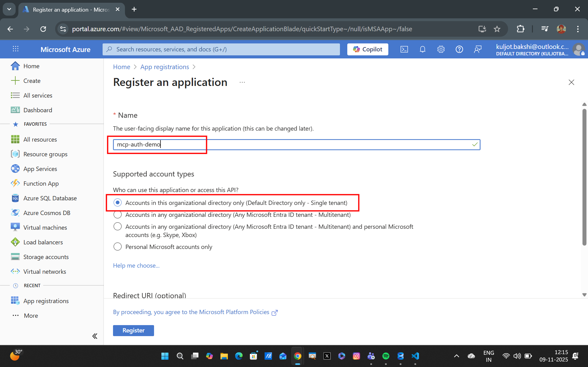
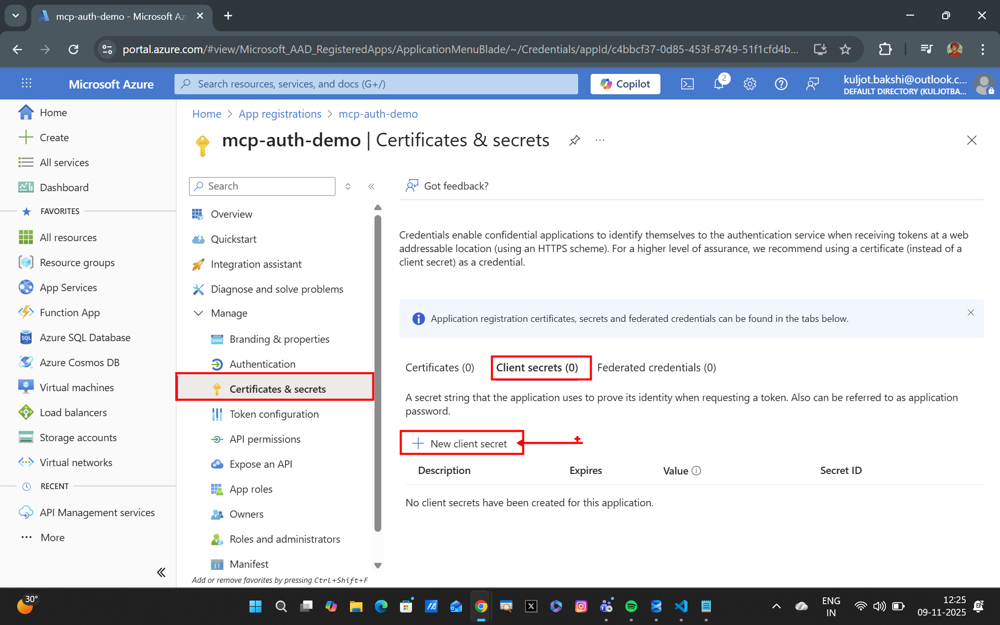
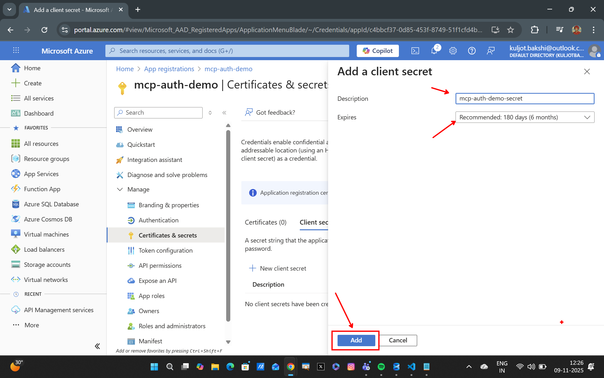
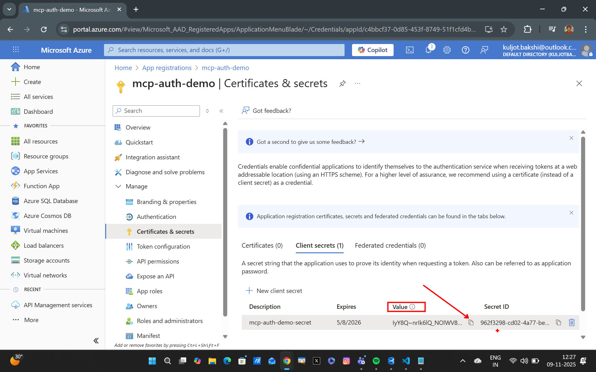

## Securing MCP Servers with Entra ID Authentication in Azure API Management


### Lab Overview
In this lab, you will learn how to secure your MCP (Managed Cloud Platform) servers in Azure API Management (APIM) using Entra ID (formerly Azure Active Directory) authentication. This involves configuring APIM to validate JWT tokens issued by Entra ID before allowing access to your MCP services.

### Step 1 : Register an Application in Entra ID
Navigate to Azure Portal and create a new application registration in Entra ID. After creation of this application, note down the `Application (client) ID`, `Directory (tenant) ID` and `Client Secret` as these will be needed later.


--

--


>**Note:** Leave the Redirect URI empty for this lab. Since its neither a web nor a mobile application.

Copy the `Client ID` and `Tenant ID` values from the application overview page.


We shall now create a client secret for this application. Navigate to the `Certificates & secrets` section and create a new client secret. Note down the generated secret value as it will be needed later.


--

--


### Step 2 : Configure API Management to use Entra ID for MCP Server Authentication
Go to the `Policies` section of your MCP server in the APIM Instance in Azure Portal and add the following policy to the `inbound` section of your API:

```xml
<validate-azure-ad-token tenant-id="{{aad-tenant-id}}">
    <client-application-ids>
        <application-id>{{aad-client-application-id}}</application-id>
    </client-application-ids>
</validate-azure-ad-token>
```

The final policy xml should look like this:
```xml
<!--
    - Policies are applied in the order they appear.
    - Position <base/> inside a section to inherit policies from the outer scope.
    - Comments within policies are not preserved.
-->
<!-- Add policies as children to the <inbound>, <outbound>, <backend>, and <on-error> elements -->
<policies>
	<!-- Throttle, authorize, validate, cache, or transform the requests -->
	<inbound>
		<base />
		<validate-azure-ad-token tenant-id="{your-tenant-id}">
            <client-application-ids>
                <application-id>{your-client-application-id}</application-id>
            </client-application-ids>
        </validate-azure-ad-token>
	</inbound>
	<!-- Control if and how the requests are forwarded to services  -->
	<backend>
		<base />
	</backend>
	<!-- Customize the responses -->
	<outbound>
		<base />
	</outbound>
	<!-- Handle exceptions and customize error responses  -->
	<on-error>
		<base />
	</on-error>
</policies>
```

### Step 3 : Testing Entra ID Authentication
In the first part, we shall be using our client application to obtain an access token from Entra ID. You can use the following sample code to get the token:

Use the following Python code to obtain an access token from Entra ID:
```python
import requests

# --- Replace with your actual values ---
tenant_id = "YOUR_TENANT_ID"
client_id = "YOUR_CLIENT_ID"
client_secret = "YOUR_CLIENT_SECRET"
scope = "https://graph.microsoft.com/.default"

# Token endpoint for your tenant
token_url = f"https://login.microsoftonline.com/{tenant_id}/oauth2/v2.0/token"

# Request body
payload = {
    "client_id": client_id,
    "client_secret": client_secret,
    "scope": scope,
    "grant_type": "client_credentials"
}

# Request the token
response = requests.post(token_url, data=payload)
if response.status_code == 200:
    token_data = response.json()
    access_token = token_data["access_token"]
    with open("token.jwt", "w") as token_file:
        token_file.write(access_token)
else:
    print("Failed to get token:", response.status_code, response.text)
```

Running this code will generate a file named `token.jwt` containing the access token.

### Step 4: Use the Access Token to Call the MCP Server
Now, use the obtained access token to call the MCP server secured with Entra ID authentication. Use the [Entra ID Auth Jupyter Notebook](./mcp_with_ai_agent_entra_id_auth/Entra_ID_Auth.ipynb) to test the setup with Azure AI Foundry Agent.

### Summary
In this lab, you have successfully secured your MCP servers in Azure API Management using Entra ID authentication. You registered an application in Entra ID, configured APIM to validate JWT tokens, and tested the setup by obtaining an access token and calling the MCP server. This ensures secure access to your MCP services through proper authentication mechanisms.


