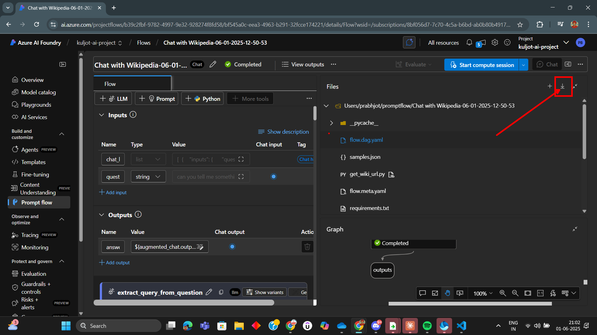
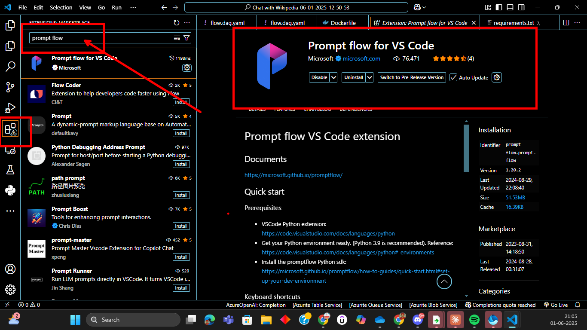
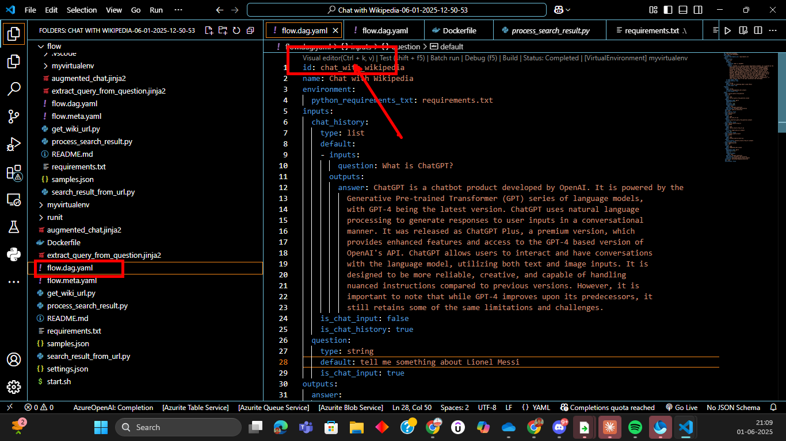
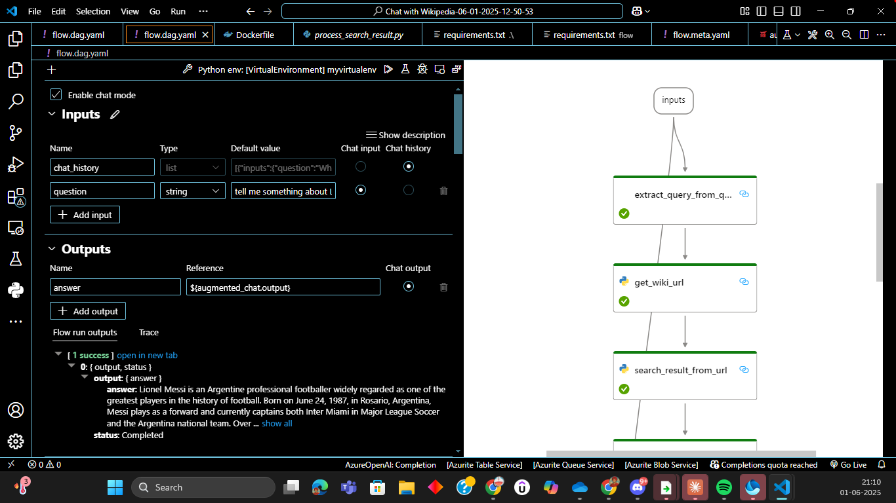
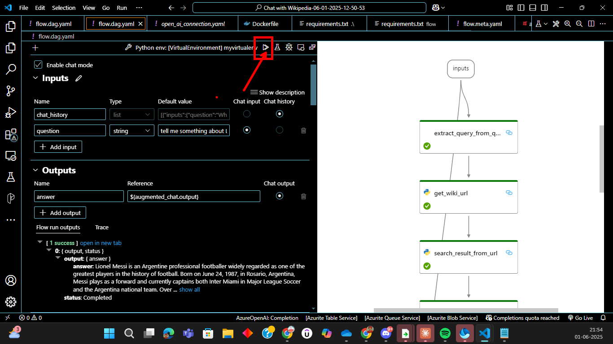
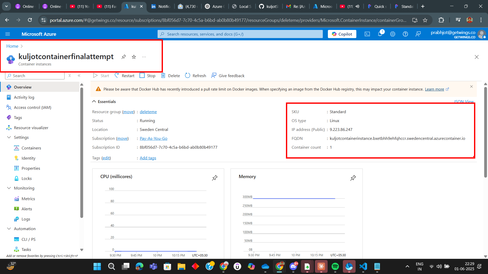

## Developing and Deploying a Prompt Flow to Azure Container Instance


### Prompt Flow CLI Installation

Install using `winget`
```
winget install -e --id Microsoft.Promptflow
```

Check Installation and version
```
pf --version
```

### Step 1: Download Prompt Flow Directory On Local Machine's VSCode Environment (IDE)



---

### Step 2: Download "Prompt Flow" Extension from the VSCode Marketplace



---

### Step 3: Open the Visual Editor for the flow.day.yaml file





---

### Step 4: Fill in the Values for the Azure OpenAI connection


---

### Step 5: Test the Prompt Flow within the "Visual Designer"



or try out with the CLI:
```
pf flow test --flow .  # "." is the root directory reference here
```
---

### Step 6 (Optional): Creating a new Azure OpenAI Connection

run the following coomand in the terminal:
``` 
python "<PATH-TO-PROMPT-FLOW-EXTENSION>" connection upsert --file "<PATH-TO-YOUR-CONNECTION-YAML-FILE>" 
```

Pip commands:
```
pip install promptflow==1.17.2
pip install promptflow-tools==1.4.0
```
---


### Step 7: Containerise your Prompt Flow

run the following command to containerise the Prompt Flow and Generate a DockerFile for the same:

```
pf flow build --source <path-to-your-flow-folder> --output <your-output-dir> --format docker
```

Start Docker Desktop to initiate the Docker Daemon in the back-running process and execute the following command:
```
docker build <PATH-TO-YOUR-FOLDER-CONTAINING-DOCKER-FILE> -t web-classification-serve 
```

---

### Step 8: Get the containerised image up and running

The started service will listen on port 8080.You can map the port to any port on the host machine as you want.

```
docker run -p 8080:8080 -e OPEN_AI_CONNECTION_API_KEY="<YOUR-AZURE-OPENAI-API-KEY>" -e PROMPTFLOW_WORKER_NUM="1" -e PROMPTFLOW_WORKER_THREADS="1" chat-with-wikipedia-serve
```

---

### Step 9: Push the image to your GHCR (GitHub Container Registry)

make sure to run `docker push` command to push image to GHCR 

Note: The image should be in the following format:
`<your-github-username>/<grouping-name for eg: prompt-flow>:<name-of-the-image>`

### Step 10: Deploy the Image to Azure Container Instance



